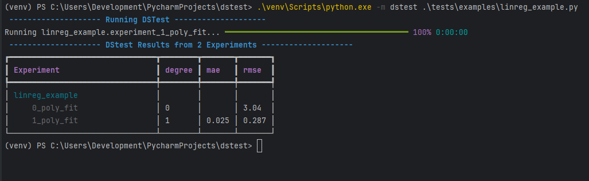

DSTest
======

DSTest is my idea of having a more reproducable approach to data science experimentation. 
Currently there are 2 common ways to experiment notebooks and experiment logging. 

In both cases it will be very hard to bring old results back once you iterated far enough
from the original. This is where dstest comes in.

The Idea
--------

You write your experiments as unittests and you keep them. Any thing you want to keep between experiments,
you put into fixtures. The results are written into readable format that can easily be reproduced any time. 

Found a bug in your preprocessing that invalidates all your previous results?
Simply run all your experiments again in an instant.

Syntax
------

I'm conciously trying to stay as close as possible to the normal unit testing syntax.
  
  from dstest import registry

  def experiment_0_poly_fit(linear_dummy_data):
    """
    This docstring will be parsed as markdown
    """
    x, y = linear_dummy_data
    c = np.polyfit(x, y, 0)
    model = lambda _: c[0]
    rmse = calculate_rmse(model(x), y)
    registry.log_parameters(degree=0)
    registry.log_metrics(rmse=round(rmse, 3))

Any function starting with "experiment_" is recognised as an experiment. simply log any parameters / metrics
of the experiment to the registry and they will be correctly attributed. 
linear_dummy_data is a fixture, it works as follows:

  from dstest import fixture

  @fixture
  def linear_dummy_data():
      """ Generate some linear data to run the tests on """
      numpy.random.seed(12)
      x = np.random.random(100)
      y = x + 0.1 * np.random.random(100)
      return x, y

How to run
----------

After installing dstest you can simply run it with

  dstest ./experiments

The path is simply the path in which dstest should look for experiments.
Other (not-required) options are:

 - -e (--experiment): specify a single experiment to run.
 - -o (--output): File where results are written in csv format
 - -m (--markdown): File where to write results in markdown format

If it would, you should see the cli tool looking and running experiments. The final output will be a CLI table 
and the output files you specified

Roadmap
-------
These are the features I currently want to implement

- [X] Tests
  - [X] Basic scan and execution of tests
  - [X] Make it possible to run all tests in directory
  - [X] Make it possible to run individual test in module
- [X] Fixtures
  - [X] Basic dependency injection for fixtures
  - [X] Caching
  - [ ] Fixture Testing
- Experiment Results
  - [X] Result Registry
  - [X] Log Metrics
  - [X] Log Parameters
  - [ ] Log Plots (MPL & Plotly)
- [ ] Output & Presentation
  - [X] Progress Bar
  - [X] Present Results in console
  - [X] Output Result in CSV File
  - [X] Output results into readable file (Markdown)
    - [X] Parse Docstrings
    - [ ] Parse Code
  - [ ] Output results as Html
- [ ] Advanced Features
  - [ ] Make it possible to not rerun experiments and still see the results
  - [ ] Interactive CLI interface which shows you which module were found and allows you tu run them individually. 
  - [ ] Pycharm Plugin
- [ ] Documentation & Examples